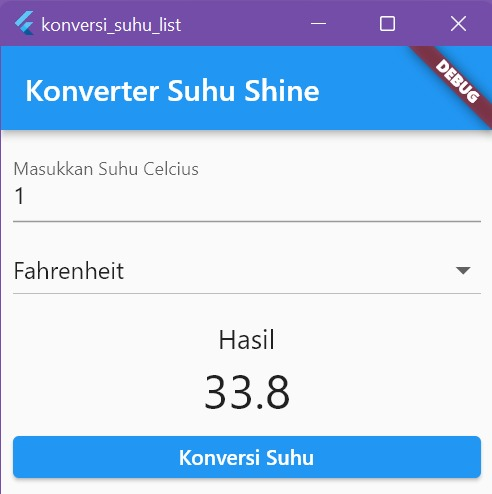
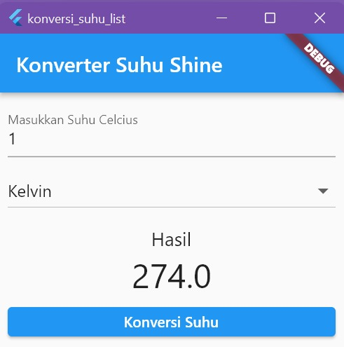
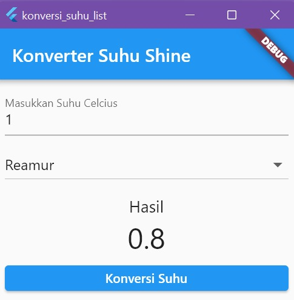
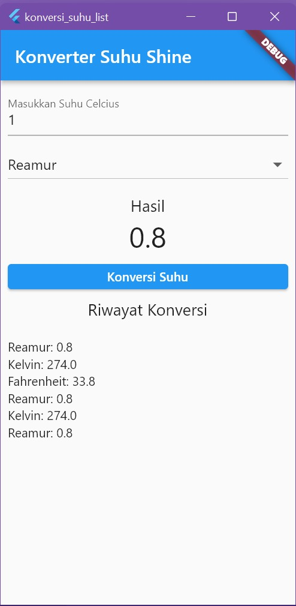

# LAPORAN PRAKTIKUM STATEFULL WIDGET DAN MAP
NAMA: SHINE DEVI OKTAVIANA R S P  
KELAS: TI 3C  
NIM: 2041720065
## 1. Tampilan awal

## 2. Menginput data, memilih target suhu, dan mengonversi suhu
A. Fahrenheit

B. Kelvin

C. Reamur

## 3. Menginput data, memilih target suhu, mengonversi suhu, dan menampilkan riwayat hasil perhitungan
